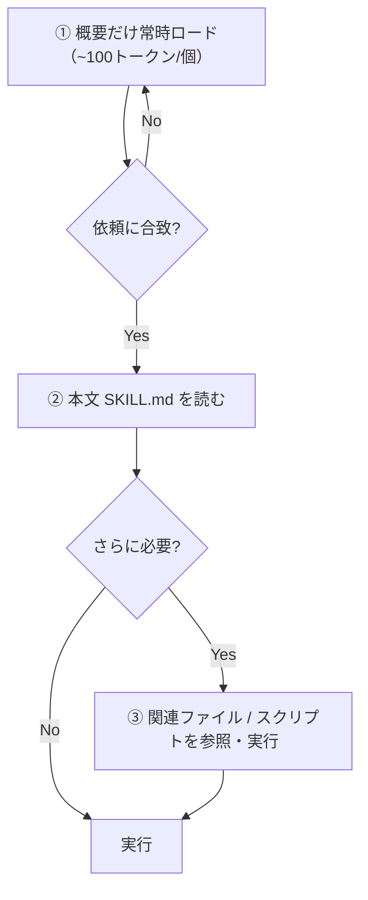

# Claude Skill 入門 🛠️

〜ハーネスエンジニアへの第一歩〜

<div class="pt-8 text-sm opacity-60">
  スペース / → で次へ ・ <kbd>o</kbd> で全体表示
</div>

<div class="abs-br m-6 text-sm opacity-50">
  使い方ガイドは <a href="./guide/">/guide/</a>
</div>

<!--
この資料自体、今日紹介する Skill を実際に使いながら作りました。
ゴールは「自分でも Skill を作ってみたい」と思ってもらうこと。
-->

---
layout: center
class: text-center
---

# ハーネスエンジニアとは？

<v-clicks>

モデル**そのもの**ではなく、モデルを動かす**「環境（ハーネス）」**を設計する人

> どんなモデルを使っても、**毎回同じ品質**の出力になる仕組みを作る

ハーネス（＝モデル以外の設定・道具・手順）を整えるだけで、<br>
ベンチマークが**十数ポイント**変わる例も報告されている

</v-clicks>

<!--
「ハーネス」は本には無い導入。馬具・装具の意。
※ ファクト注意: よく言われる「精度1.5倍」は出典が曖昧。
  公式・調査で確認できるのは「ベンチマークで十数pt改善」レベル。盛らない。
その“環境”を作る一番の武器が、今日の主役 Skill。
-->

---
layout: section
---

# 今日持ち帰ってほしいこと

<v-clicks>

- **Skill が何で、なぜ効くのか**が分かる
- MCP・CLI との**役割の違い**が分かる
- そして——**「自分でも作ってみたい」**と思える

</v-clicks>

---
layout: center
class: text-center
---

# 問題提起

AI は賢い。でも**毎回、作業手順を書かされて**いないか？

<v-click>

それは、AI が **「タスクの意味」は分かっても「やり方」を知らない**から

</v-click>

<!--
AIは「議事録を作って」の意味は分かる。
でも「この会社の議事録の作法」は毎回教えないと分からない。
-->

---

# これまでの解決策と、その限界

<v-clicks>

- 毎回**長いプロンプト**を書く → 大変・再現性が低い
- `command` に定型化 → 少し楽になった
- でも…**モデルを変える/進化すると出力がブレる** 🌀

</v-clicks>

<v-click>

> 「やり方」がAIの“気分”任せのままだと、品質が安定しない

</v-click>

---
layout: center
class: text-center
---

# Skill とは

タスクの**「やり方」そのもの**を AI に手渡す仕組み

<v-click>

→ 誰がやっても・どのモデルでも **毎回同じ品質**

</v-click>

---

# MCP サーバーとの違い

<div class="grid grid-cols-2 gap-4 pt-4">
<div>

### MCP（能力レイヤー）
さまざまなサービスに**接続する**ための仕組み

- 外部接続の**一手段**
- 仲間に **CLI** などもある

</div>
<div>

### Skill（プロセスレイヤー）
接続した道具を**どう使うか**の手順

- 「やり方」を定義
- MCP とは**役割が違う**

</div>
</div>

<v-click>

> Skill ＝レシピ / MCP ＝キッチン。**層が違う**ので競合しない

</v-click>

<!--
公式の言い方: Skills = guidance layer, MCP = execution layer。
2章の「能力レイヤー vs プロセスレイヤー」と同じ話。
-->

---

# MCP の弱点（だけではない）

<v-clicks>

- 接続はできるが、**使い方**まではくれない
- 接続した**全ツールの説明文が、常にコンテキストを占有**する
- → その分**トークンを圧迫**し、応答も重くなりがち

</v-clicks>

<v-click>

<div class="text-sm opacity-70 pt-4">
※ よくある誤解: 「通信ごとに毎回ツールを選定するから遅い」ではなく、<br>
　本質は<b>ツール定義の常時ロード</b>によるコンテキスト圧迫。
</div>

</v-click>

<!--
ファクト修正ポイント②。機構を正しく。
Skillはここを「段階的開示」で回避する、という次への布石。
-->

---

# 解決策 = Skill ＋ CLI


<v-clicks>

- CLI なら**必要な操作だけ**を最小コストで実行
- その手順を **Skill で定義** → 相性抜群・**トークン減**
- 自前スクリプトを使う → 生成ブレが消え**品質も安定**

</v-clicks>

---

# Skill の中身を見てみよう

<div class="grid grid-cols-2 gap-6 pt-4">
<div>

### 概要（YAML）
- `name` と `description`
- AI は**ここだけ見て**「いつ使うか」を判断

</div>
<div>

### 本文（Markdown）
- 実際の手順・ベストプラクティス
- **使うと決めた時だけ**読み込まれる

</div>
</div>

<v-click>

> 概要は常時ロード（1つ ~100トークン）。だから**何個入れても軽い**

</v-click>

---

# 段階的開示（Progressive Disclosure）



<!--
使った分しかトークンを使わない。これがMCPとの決定的な差。
-->

---

# 関連ファイルは3種類

| フォルダ | 中身 | 役割 |
| --- | --- | --- |
| `scripts/` | 関数・実行コード | 決まった処理を**確実に**（実行してもコンテキストを食わない） |
| `references/` | 本文に入り切らないルール・仕様 | **必要な時だけ**参照 |
| `assets/` | テンプレ・画像・データ | **出力に使う**素材 |

<v-click>

<div class="text-sm opacity-70 pt-2">
※ 本文の「500行以内」は<b>必須の上限ではなく目安</b>。
　ハード制約は name ≤ 64文字 / description ≤ 1024文字。
</div>

</v-click>

<!--
ファクト修正ポイント③。500行は best practices の推奨。
あぶれたルールは references/ へ、が定石。
-->

---
layout: center
class: text-center
---

# たとえるなら「料理本」

<v-clicks>

📚 本棚の**背表紙**を見て、どのレシピ本が要るか選ぶ（＝概要）

📖 選んだ本の**ページ**を開く（＝本文）

🥄 必要なら**計量スプーン**を使って作る（＝スクリプト）

</v-clicks>

<v-click>

> いくら本棚が大きくても、**開いた本のぶんしか**頭を使わない

</v-click>

---

# CLAUDE.md との違い

<div class="grid grid-cols-2 gap-6 pt-6">
<div>

### CLAUDE.md
- プロジェクト全体の概要・ルール
- **常時**参照される

</div>
<div>

### Skill
- 特定タスクの「やり方」
- **必要な時だけ**参照される

</div>
</div>

<v-click>

> 「いつも効くルール」と「ここぞで効く手順」。**役割が明確に違う**

</v-click>

---

# Skill で何ができる？

<v-clicks>

- **会社固有の知識**を仕込む（「この取引先は数字重視」「この案件は納期最優先」）
- **過去の教訓**を残す
- スクリプトで**ファイル生成・正確な集計**
- **ワークフローを統一** → 毎回同じ手順・同じ品質

</v-clicks>

<v-click>

> ＝ ハーネスエンジニアの理想「どのモデルでも同じ品質」を叶える道具

</v-click>

---
layout: center
class: text-center
---

# 整理：能力レイヤー vs プロセスレイヤー（2章）

<div class="grid grid-cols-2 gap-6 pt-4 text-left">
<div>

### 能力レイヤー
**何ができるか**を提供
- MCP
- CLI

</div>
<div>

### プロセスレイヤー
**どうやるか**を提供
- Skill

</div>
</div>

<v-click>

> どちらを使うかは**ケースバイケース**。組み合わせて使うのが基本

</v-click>

---
layout: section
---

# ここから実演

この資料も、**Skill を使いながら**作りました

---

# 使ったスキル①：フロント / デザイン系

<v-clicks>

- 狙いは **「AIっぽいデザイン（AIスロップ）にしない」**
- 5つの観点で、あえて**テンプレの型を破る**よう促す
- **テーマファクトリー**で既存サイト/スライドに統一感を付与（参考サイトに寄せることも可）

</v-clicks>

<div class="abs-br m-6 text-xs opacity-50">
※ 実演スクショをここに差し込む
</div>

<!--
frontend-design / canvas-design スキルの話。
実際に当てた before/after をここで見せると説得力が出る。
-->

---

# 使ったスキル②：（作りながら追記）

<div class="opacity-70">

実際にスキルを当てた**出力スクショ**をここに入れる予定

- 入力（依頼）
- スキルあり / なし の違い

</div>

<div class="abs-br m-6 text-xs opacity-50">
※ 実演スクショ枠
</div>

---

# スキルを作るスキル（skill-creator）


<v-clicks>

- 作りたいものを伝えると、**ヒアリング→生成→テスト→改善**を回す
- **発動ワード（description）**まで自動で最適化してくれる

</v-clicks>

---
layout: center
class: text-center
---

# 公開スキルを使うときの注意

<v-clicks>

スキルは**指示とコードの塊** → 悪意あるものは情報漏洩・不正操作の恐れ

> **公式（`anthropics/skills`）または自作**のものだけを使う

特に**外部URLから取得**するスキルは要注意

</v-clicks>

<!--
9章の「公式から出ているものを使う」を、公式のセキュリティ警告で裏打ち。
-->

---

# おまけ：このスライドは Slidev 製

<div class="grid grid-cols-2 gap-6 pt-4">
<div>

- **Markdown** で書ける
- Vue / アニメーション / Mermaid 図
- そのまま **Web に公開**（GitHub Pages）

</div>
<div>

```md
---
layout: center
---

# 1スライド1メッセージ

- 箇条書き
- ` ```mermaid ` で図解
```

</div>
</div>

---
layout: center
class: text-center
---

# まとめ

<v-clicks>

Skill ＝ AI に**「やり方」を手渡す**仕組み

段階的開示で**軽いまま**、どのモデルでも**同じ品質**

そして、**自分で作れる**

</v-clicks>

<v-click>

## さあ、あなたの Skill を作ろう 🛠️

</v-click>

---
layout: center
---

# 参考

- 『**Claude Code で学ぶ Agent Skills 入門**』佐藤 亮（Kindle版）
- 公式: Agent Skills — Claude Docs
- 公式スキル: github.com/anthropics/skills

<div class="text-sm opacity-60 pt-6">
引用は最小限・要約は自分の言葉で（著作権配慮）
</div>
