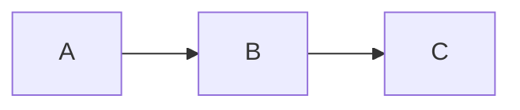

# Slidev 使い方 & カスタムガイド

このプロジェクトで使う Slidev の機能を、実例つきで体系的にまとめたリファレンス。
**実際に動くデモ**は [`slides.md`](../slides.md) にあるので、まず動かして見てください。

```bash
npm run dev          # slides.md を http://localhost:3030 で開く
npm run dev examples/book-template.md   # 別ファイルを開く
```

> 用語: ここで言う「ユーティリティクラス」は Slidev に内蔵された **UnoCSS**（Tailwind 互換）のクラスのこと。`p-4` `flex` `text-rose-500` などがそのまま使える。

---

## 1. 基本のしくみ

- スライドは **`---`（前後に空行）** で区切る。
- 各スライド先頭の `---` 〜 `---` がそのスライドの **フロントマター**（設定）。
- **一番上**のスライドのフロントマターは「デッキ全体の設定」になる（`theme` / `title` / `transition` など）。
- 本文は普通の Markdown。さらに **HTML・Vue コンポーネント・ユーティリティクラス**を直接書ける。

```md
---
theme: seriph        # デッキ全体の設定（最初のスライドのみ）
title: タイトル
transition: slide-left
mdc: true            # Markdown Components 構文を有効化
---

# 最初のスライド

---
layout: center       # 2枚目以降は「そのスライドの設定」
class: text-center
---

# 2枚目
```

### よく使うスライド単位のフロントマター

| キー | 役割 |
| --- | --- |
| `layout` | レイアウト（`center` `two-cols` `image-right` …） |
| `transition` | このスライドへの遷移（`fade` `slide-left` `slide-up` `view-transition`） |
| `class` | ルート要素に付く CSS クラス（`text-center` など） |
| `clicks` | クリック総数の明示指定 |
| `hide` / `disabled` | スライドを非表示にする |
| `src` | 別 md ファイルを読み込んで合成（`src: ./parts/intro.md`） |

---

## 2. レイアウト

`layout:` で切り替える。seriph テーマで使える主なもの:

| layout | 用途 |
| --- | --- |
| `cover` / `intro` | 表紙 |
| `center` | 中央寄せ |
| `section` | 章の扉 |
| `two-cols` / `two-cols-header` | 2カラム |
| `image-right` / `image-left` | 片側に画像 |
| `quote` / `fact` / `statement` | 引用・数字・宣言 |
| `full` / `default` | フル/標準 |

**2カラム**は `::left::` / `::right::` のスロットで書く:

```md
---
layout: two-cols
---

# 左カラム
左の内容

::right::

# 右カラム
右の内容
```

**画像レイアウト**:

```md
---
layout: image-right
image: /diagram.png   # public/diagram.png を参照
---

# 説明
左にテキスト、右に画像
```

> 画像は `public/` に置き、`/ファイル名` で参照する（先頭スラッシュ必須）。

---

## 3. アニメーション

Slidev のアニメは大きく3種類。

### (a) クリックで段階表示 — `v-click`

```html
<!-- 1つずつ出す -->
<div v-click>1番目</div>
<div v-click>2番目</div>

<!-- リストをまとめて -->
<v-clicks>

- A
- B
- C

</v-clicks>

<!-- 順番・範囲・消す -->
<div v-click="3">3番目に出る</div>
<div v-click="[2, 4]">2回目で出て4回目で消える</div>
<div v-click.hide="2">2回目で消える</div>
<div v-after>直前の v-click と同時に出る</div>
```

- `v-clicks` には `depth`（ネストの深さ）や `at` も指定可。
- テンプレート内で現在のクリック数は **`$clicks`**、ページ番号は **`$page`**、総数は **`$nav.total`** で参照できる。

### (b) 要素モーション — `v-motion`（@vueuse/motion 内蔵）

「初期状態 → 入場状態」を宣言すると、表示時に補間アニメする。

```html
<div
  v-motion
  :initial="{ x: -120, opacity: 0 }"
  :enter="{ x: 0, opacity: 1, transition: { delay: 200 } }"
>
  左からスライドイン
</div>
```

- `:initial` 初期、`:enter` 表示後、`:click-1` のように **クリック連動**も可能。
- `transition: { delay, duration, type: 'spring', stiffness }` などで調整。

### (c) スライド遷移 — `transition`

```md
---
transition: fade        # fade / slide-left / slide-up / view-transition ...
---
```

デッキ全体に効かせるなら最初のスライドのフロントマターで指定。

---

## 4. ライブラリを使ったアニメ（GSAP）

外部 JS ライブラリは「`npm i` して、`components/` の Vue コンポーネント内で `import` して使う」のが基本パターン。`components/` 配下の `.vue` は **自動インポート**され、スライドにそのままタグで置ける。

```bash
npm i gsap
```

```vue
<!-- components/GsapBoxes.vue -->
<script setup lang="ts">
import { onMounted, ref } from 'vue'
import { gsap } from 'gsap'

const root = ref<HTMLElement | null>(null)
function play() {
  const boxes = root.value!.querySelectorAll('.gsap-box')
  gsap.set(boxes, { opacity: 0, y: 40, scale: 0.6 })
  gsap.to(boxes, {
    opacity: 1, y: 0, scale: 1,
    duration: 0.8, ease: 'back.out(1.7)', stagger: 0.15,
  })
}
onMounted(play)
</script>

<template>
  <div ref="root"> ... <button @click="play">▶ 再生</button> </div>
</template>
```

スライド側:

```md
<GsapBoxes />
```

このプロジェクトの実例:
- [components/GsapBoxes.vue](../components/GsapBoxes.vue) — stagger + back イージングで四角形を順番に出す
- [components/GsapCounter.vue](../components/GsapCounter.vue) — `gsap.to(obj, { val, onUpdate })` で数値カウントアップ

> ポイント: GSAP の典型テクニックは「ダミーオブジェクトの数値を tween し、`onUpdate` で DOM/表示を書き換える」。`ScrollTrigger` など追加プラグインも `import` するだけ。

---

## 5. アイコン（Bootstrap Icons / Carbon など）

Slidev は **UnoCSS preset-icons** を内蔵。使いたいアイコンセットを入れるだけ。

```bash
npm i -D @iconify-json/bi        # Bootstrap Icons
npm i -D @iconify-json/carbon    # Carbon
```

2通りの書き方:

```html
<!-- (1) クラス形式（確実・推奨）: i-<セット>-<名前> -->
<span class="i-bi-rocket-takeoff text-5xl text-rose-500" />
<span class="i-carbon-logo-github text-4xl" />

<!-- (2) コンポーネント形式（Slidev が解決） -->
<bi-rocket-takeoff class="text-5xl" />
<carbon-logo-github />
```

- 色は `text-*`、サイズは `text-*` か `w-* h-*`。
- アイコン名は **<https://icones.js.org>** で検索（コピーすると `i-bi-...` 形式で取れる）。
- ビルド時は「使ったアイコンだけ」がインライン化されるので軽い。

---

## 6. UI の作り方

### (a) ユーティリティクラスで作る（UI ライブラリ不要）

カード・ボタン・グリッドはクラスの組み合わせで十分作れる:

```html
<div class="grid grid-cols-3 gap-5">
  <div class="p-5 rounded-2xl bg-gradient-to-br from-teal-500 to-emerald-600 text-white shadow-xl">
    <div class="i-bi-stars text-3xl" />
    <div class="text-lg font-bold mt-2">タイトル</div>
  </div>
</div>
```

### (b) Slidev 組み込みコンポーネント

標準で使える UI 部品（import 不要）:

| コンポーネント | 用途 |
| --- | --- |
| `<Toc />` | 目次を自動生成 |
| `<Arrow x1 y1 x2 y2 />` | 矢印を描画 |
| `v-drag="[x,y,w,h]"` | 要素をドラッグ移動可能に（ディレクティブ） |
| `<Youtube id="..." />` | YouTube 埋め込み |
| `<Tweet id="..." />` | ツイート埋め込み |
| `<Link to="..."/>` | スライド間リンク |
| `<SlidevVideo>` | 動画 |
| `<Transform :scale="1.2">` | 拡大縮小ラッパ |

> 注意: `v-drag` は **ディレクティブ**。`<div v-drag="[80,280,180,60]">…</div>` のように要素に付ける（`<v-drag="...">` は不可）。

### (c) 本格的な Vue UI ライブラリを入れる（例: Element Plus）

`setup/main.ts` で Vue アプリにプラグインを登録できる:

```bash
npm i element-plus
```

```ts
// setup/main.ts
import { defineAppSetup } from '@slidev/types'
import ElementPlus from 'element-plus'
import 'element-plus/dist/index.css'

export default defineAppSetup(({ app }) => {
  app.use(ElementPlus)
})
```

以降スライドで `<el-button type="primary">OK</el-button>` のように使える。
（重いので、必要なときだけ。多くの場合はユーティリティ + 組み込みで足りる）

---

## 7. コード表現

### ハイライト & 行送り

```` ```ts {1|2-3|all} ```` のように書くと、クリックで **ハイライト行が移動**:

````md
```ts {1|2-3|5|all}
const user = await fetchUser(id)
if (!user) throw new Error('not found')
const profile = await fetchProfile(user)

return render(profile)
```
````

- `{2,4}` 固定ハイライト、`{1|2|3}` クリック送り、`{*}{lines:true}` 行番号表示。

### Magic Move（コードが変形）

クリックで前後のコードが **差分アニメ**で書き換わる。`````md magic-move````` の中に複数のコードブロックを並べる:

````md
```ts
function sum(list) { /* before */ }
```

```ts
const sum = (list: number[]) => list.reduce((a, b) => a + b, 0)
```
````

（↑ 実際は外側を 4 個のバックティック + `md magic-move` で囲む。実例は `slides.md` の該当スライド）

### Mermaid 図 と 数式

````md

````

```md
インライン $E = mc^2$ / ブロック数式:

$$ \frac{1}{n}\sum_{i=1}^{n}(\hat y_i - y_i)x_i $$
```

---

## 8. 発表者ノート

各スライドの末尾に HTML コメントを置くと **presenter notes** になる。

```md
# スライド本文

<!--
ここが発表者ノート。Presenter モードで見える。
公開物から消すには npm run build -- --without-notes
-->
```

---

## 9. カスタムのレイヤー早見表

| やりたいこと | 触る場所 |
| --- | --- |
| 1スライドの色・余白 | スライド内 `<style>` / `class=` |
| 全体の見た目 | `theme:` 変更、または `styles/` ・ `setup/` |
| 再利用する部品 | `components/*.vue`（自動読込） |
| JS ライブラリ導入 | `npm i` → コンポーネントで `import` |
| Vue プラグイン / グローバル登録 | `setup/main.ts` |
| UnoCSS 設定（ショートカット等） | `uno.config.ts` |
| Vite / ビルド設定 | `vite.config.ts` |
| グローバル CSS | `style.css`（自動読込） |

スライド単位の `<style>` は **scoped**（そのスライドだけ）。全体に効かせたいときは `<style>` に `:global(...)` を使うか `style.css` に書く。

> 注意: スライド内 `<style>` の **コメントに `<style>` という文字列を書かない**こと。HTML パーサが要素開始と誤認してビルドエラー（"Element is missing end tag"）になる。

---

## 9.5. デザインシステム（共通の色 & カスタム CSS）

「使う色を決めて、どのスライドでも同じ見た目を再利用する」には2つの仕組みを使う。
このプロジェクトでは実際に設定済み（[../uno.config.ts](../uno.config.ts) / [../style.css](../style.css)、デモは `slides.md` の 13-12）。

### (a) `uno.config.ts` — 色トークン & 再利用クラス

Slidev はルートの `uno.config.ts` を読み込み、**内蔵設定（アイコン等）とマージ**する。

```ts
// uno.config.ts
import { defineConfig } from 'unocss'

export default defineConfig({
  theme: {
    colors: {
      brand: { DEFAULT: '#0d9488', light: '#5eead4', dark: '#0f766e' },
      accent: '#e11d48',
    },
  },
  shortcuts: {
    // クラスの組み合わせに名前を付けて再利用
    btn: 'px-4 py-1.5 rounded-lg bg-brand text-white hover:bg-brand-dark transition',
    card: 'p-5 rounded-2xl bg-white/60 shadow-lg ring-1 ring-black/5',
    chip: 'inline-flex items-center px-2.5 py-0.5 rounded-full text-sm bg-brand-light/30 text-brand-dark',
  },
})
```

- 定義した色は `bg-brand` / `text-accent` / `border-brand-dark` のように **どのスライドでも**使える。
- `shortcuts` は `<button class="btn">` / `<div class="card">` のように使い回せる（後から一括変更も楽）。
- 重要: `uno.config.ts` を置いても **preset-icons などはマージで維持**される（アイコンは壊れない）。

### (b) `style.css` — グローバル CSS & デザイントークン

ルートの `style.css` は自動読込。CSS 変数（トークン）や全スライド共通のスタイルを書く。

```css
:root {
  --brand: #0d9488;
  --accent: #e11d48;
}

/* 例: すべての見出しの下にアクセントライン */
.slidev-layout h1::after {
  content: '';
  display: block;
  width: 2.5rem; height: 3px;
  background: linear-gradient(90deg, var(--brand), var(--accent));
}

::selection { background: color-mix(in srgb, var(--brand) 35%, transparent); }
```

- 素の CSS からは `var(--brand)` でトークン参照。
- `.slidev-layout` は各スライドのルート要素。これを起点に全体へ効かせる。

### 使い分け

| やりたいこと | 場所 |
| --- | --- |
| 色・余白の値を1か所で管理 | `uno.config.ts` の `theme` ＋ `style.css` の `:root` 変数 |
| 「ボタン」「カード」等の再利用パーツ | `uno.config.ts` の `shortcuts` |
| 全スライド共通の地のスタイル | `style.css` |
| このスライドだけの微調整 | スライド内 `<style>`（scoped） |
| 全ページ共通の“要素”（ロゴ等） | `global-top.vue` / `global-bottom.vue` |

---

## 10. ビルド & 公開

```bash
npm run build                            # dist/ に静的出力（SPA）
npm run build -- --base /cluade-purezen/ # GitHub Pages 用（サブパス）
npm run build -- --download              # PDF 同梱
npm run build -- --without-notes         # 発表者ノートを除外
npm run export                           # PDF / PNG 等にエクスポート（playwright が必要）
```

公開（GitHub Pages）の手順は [project-plan.md](./project-plan.md) と [../CLAUDE.md](../CLAUDE.md) を参照。

---

## 参考リンク

- 公式ドキュメント: <https://sli.dev>
- アニメーション（Click / Motion）: <https://sli.dev/guide/animations>
- アイコン: <https://sli.dev/features/icons> ／ 検索: <https://icones.js.org>
- 組み込みコンポーネント: <https://sli.dev/builtin/components>
- GSAP: <https://gsap.com/docs/v3/>
