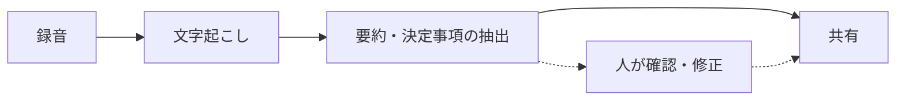

# AI議事録ツールの調査結果と試験導入の提案

〔要記入：部署名〕 〔要記入：発表者〕 〔要記入：発表日〕

<!--
〔要記入〕が残っている間は npm run lint:slides が警告を出す。
公開前は npm run lint:slides:strict で 0 件にする。
-->

---

# この資料で決めたいのは、AI議事録を試験導入するかどうかです

- 決めたいこと: 〔要記入：例 どのチームで・何週間・どのツールを試すか〕
- 判断に使う情報: 現状の作業時間、候補ツールの比較、情報管理上の条件
- 今日は扱わないこと: 〔要記入〕

<!--
冒頭で「聞き終わったら何を判断してほしいか」を言う。
結論は次のスライドで先に出す。
-->

---

# 〔要記入：調査の結論を主語と述語のある一文で〕

1. 〔要記入：根拠1〕
2. 〔要記入：根拠2〕
3. 〔要記入：根拠3〕

<!--
結論を先に言う。根拠は3つまで。
このスライドだけ見れば判断できる状態にする。
-->

---
layout: section
---

# 現状

議事録づくりに今どれだけ時間を使っているか

---

# 議事録の作成に、会議1回あたり〔要記入〕分かかっている

- 計測した範囲: 〔要記入：チーム・期間・会議の件数〕
- 計測のしかた: 〔要記入：例 作成者に所要時間を記録してもらった〕
- 作業の内訳: 〔要記入：聞き直し・清書・共有などの比率〕

<Source measured todo />

<!--
数字は必ず実測か出典つき。推計なら推計と書く。
-->

---

# AI議事録は、録音から共有までの4工程を自動でつなぐ

- 人の作業は「書く」から「確認して直す」に変わる
- 誤認識と要約漏れは残るので、確認の工程は省けない

<!--
ツールごとに自動化される範囲が違う。次の比較表でそこを見る。
-->

---
layout: section
---

# 比較

候補ツールと、導入前後の作業の違い

---

# 候補ツールは〔要記入：差がつく観点〕で差がつく

| 観点 | 〔ツールA〕 | 〔ツールB〕 | 〔ツールC〕 |
| --- | --- | --- | --- |
| 日本語の認識精度 | 〔要記入〕 | 〔要記入〕 | 〔要記入〕 |
| 話者の識別 | 〔要記入〕 | 〔要記入〕 | 〔要記入〕 |
| 録音データの保存先 | 〔要記入〕 | 〔要記入〕 | 〔要記入〕 |
| 費用 | 〔要記入〕 | 〔要記入〕 | 〔要記入〕 |
| 既存ツールとの連携 | 〔要記入〕 | 〔要記入〕 | 〔要記入〕 |

<Source todo />

<!--
比較の観点は、判断に効くものだけ残す。差がつかない行は消す。
-->

---
layout: two-cols-header
class: reveal-compare
---

# 導入すると、議事録担当の仕事は「書く」から「確かめる」に変わる

::left::

### 今

- 会議中にメモを取る
- 会議後に録音を聞き直して清書する
- 決定事項と宿題を書き出して共有する

::right::

### 導入後

- 会議中は議論に参加できる
- 自動で出た文字起こしと要約を確認して直す
- 決定事項と宿題の抜けを確かめて共有する

<!--
比較なので v-click を使う（class: reveal-compare）。
左を話し終えてから右を出す。
-->

---

# 社外秘の会議に使う前に、録音データの扱いを決めておく必要がある

- 保存先と保存期間: 〔要記入：ツールの仕様と社内規程の照合結果〕
- 学習への利用: 入力したデータがモデルの学習に使われない設定にできるか
- 参加者への告知: 録音していることを会議の冒頭で伝える
- 対象外にする会議: 〔要記入：例 人事・未公表の案件〕

<!--
情報システム部門・法務に確認した結果があればここに書く。
-->

---
class: reveal-steps
---

# 試験導入は3段階で進め、〔要記入〕週間後に続けるかを判断する

<v-clicks>

1. 1チームで〔要記入〕週間使い、作成時間と修正量を記録する
2. 導入前の実測値と比べ、確認にかかった時間も含めて評価する
3. 結果をこの形式で共有し、対象を広げるかを決める

</v-clicks>

<Source measured todo />

<!--
手順なので v-click を使う（class: reveal-steps）。済んだ手順は薄くなる。
-->

---

# この資料の数字と比較は、すべて次の出典にもとづいている

- 〔要記入：書名・記事名／発行元／公開日／URL〕
- 〔要記入：社内の計測記録の保存場所〕
- デザイン: デジタル庁デザインシステム（DADS）デザイントークン

<!--
出典は「誰が・いつ・どこで」出したかが分かる形で書く。
-->
