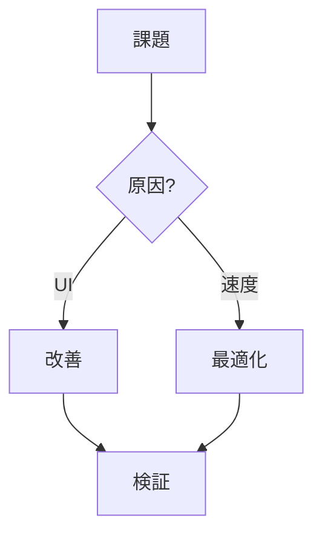
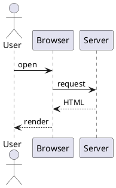

# Slidev 実践ガイド 🚀

Markdown でスライドを書き、Vue / アニメーション / ライブラリで自由にカスタムする

<div class="pt-8 text-sm opacity-60">
  スペース / → で次へ ・ <kbd>o</kbd> で全体表示 ・ <kbd>d</kbd> でダークモード切替
</div>

<!--
これは発表者ノート。Presenter モード（右下のメニュー → Presenter）で見える。
公開時に隠すには: npm run build -- --without-notes
-->

---
layout: default
---

# このデッキで分かること

<v-clicks>

- 📝 **基本** — スライドの区切り・フロントマター・Markdown
- 🧩 **レイアウト** — cover / center / two-cols / image-right …
- ✨ **アニメーション** — `v-click` / `v-motion` / スライド遷移
- 🎬 **GSAP** — ライブラリを組み込んだ本格アニメ
- 🎨 **アイコン** — Bootstrap Icons / Carbon（UnoCSS preset-icons）
- 🛠 **UI** — UnoCSS ユーティリティ & Slidev 組み込みコンポーネント
- 🧪 **コード** — ハイライト・行送り・Magic Move・Mermaid・数式

</v-clicks>

<div v-click class="mt-6 text-sm opacity-60">
  ※ ソース全文は <code>slides.md</code>、文章での詳説は <code>docs/slidev-guide.md</code> にあります
</div>

---
layout: section
---

# 1. 基本のしくみ

`---` でスライドを区切るだけ

---

# スライドの構造

スライドは `---`（前後に空行）で区切る。各スライド先頭の `---` 〜 `---` は
そのスライドの **フロントマター**（設定）。

```md
---
layout: center      # レイアウト
transition: fade    # このスライドへの遷移
class: text-center  # ルート要素に付く CSS クラス
---

# 見出し

本文は **普通の Markdown**。`<div>` など HTML も Vue もそのまま書ける。
```

<div class="mt-4 text-sm opacity-70">
一番上のスライドのフロントマターは「デッキ全体の設定」（theme / title など）になる。
</div>

---
layout: two-cols
---

# 2. レイアウト

左に `::left::`、右に `::right::` を書くと
**2カラム** になる。

`layout: two-cols` を指定。
画像・図・比較に便利。

::right::

<div class="pl-4">

```md
---
layout: two-cols
---
# 左
::right::
# 右
```

よく使うレイアウト:
- `cover` / `intro` 表紙
- `center` 中央寄せ
- `section` 章扉
- `image-right` / `image-left`
- `quote` / `fact` / `statement`

</div>

---
transition: fade
layout: center
class: text-center
---

# `transition: fade`

このスライドは **フェード** で入ってくる。<br>
他に `slide-left` / `slide-up` / `view-transition` などがある。

---

# 3. クリックアニメーション `v-click`

要素を1つずつ表示する。<kbd>Space</kbd> / <kbd>→</kbd> で進む。

<div class="grid grid-cols-2 gap-8 mt-4">
<div>

`v-clicks` でリストを順番に:

<v-clicks>

- まず これ
- 次に これ
- 最後に これ

</v-clicks>

</div>
<div>

個別指定・順番・範囲も自由:

<div v-click="1">① 最初に出る (v-click="1")</div>
<div v-click="3">③ 3番目に出る</div>
<div v-click="2">② 2番目に出る</div>
<div v-click.hide="4" class="text-teal-500">4回目で消える (v-click.hide)</div>

</div>
</div>

<div v-after class="mt-6 text-sm opacity-60">
  v-after は「直前の v-click と同時」。現在のクリック数 → <span class="font-bold">{{ $clicks }}</span>
</div>

---

# 4. 要素モーション `v-motion`

`v-motion` で「初期状態 → 入場状態」を指定すると、表示時に動く（@vueuse/motion 内蔵）。

<div class="flex gap-6 mt-10 justify-center">
  <div
    v-motion
    :initial="{ x: -120, opacity: 0 }"
    :enter="{ x: 0, opacity: 1, transition: { delay: 200 } }"
    class="w-28 h-28 rounded-xl bg-rose-500 grid place-items-center text-white"
  >左から</div>

  <div
    v-motion
    :initial="{ y: 120, opacity: 0 }"
    :enter="{ y: 0, opacity: 1, transition: { delay: 500 } }"
    class="w-28 h-28 rounded-xl bg-amber-500 grid place-items-center text-white"
  >下から</div>

  <div
    v-motion
    :initial="{ scale: 0, rotate: 180 }"
    :enter="{ scale: 1, rotate: 0, transition: { delay: 800 } }"
    class="w-28 h-28 rounded-xl bg-sky-500 grid place-items-center text-white"
  >回転</div>
</div>

```html
<div v-motion :initial="{ x: -120, opacity: 0 }"
              :enter="{ x: 0, opacity: 1, transition: { delay: 200 } }">左から</div>
```

---
layout: center
---

# 5. GSAP でアニメーション 🎬

`npm i gsap` → `components/` に Vue コンポーネントを置くだけ

<div class="mt-8">
  <GsapBoxes />
</div>

<div class="text-sm opacity-60 mt-6 text-center">
  stagger（時間差）＋ back.out イージング。「▶ 再生」で何度でも。
</div>

---

# GSAP：数値カウントアップ

オブジェクトの値を tween して、`onUpdate` で表示を書き換えるテクニック。

<div class="grid grid-cols-3 gap-6 mt-10 text-center">
  <div>
    <div class="text-5xl font-bold text-teal-500"><GsapCounter :to="12800" /></div>
    <div class="opacity-60 mt-2">ユーザー数</div>
  </div>
  <div>
    <div class="text-5xl font-bold text-rose-500"><GsapCounter :to="98" suffix="%" /></div>
    <div class="opacity-60 mt-2">満足度</div>
  </div>
  <div>
    <div class="text-5xl font-bold text-amber-500"><GsapCounter :to="2024" /></div>
    <div class="opacity-60 mt-2">創業年</div>
  </div>
</div>

<div class="mt-10 text-sm opacity-70">

実体は [components/GsapCounter.vue](./components/GsapCounter.vue)。`gsap.to(obj, { val, onUpdate })` で実装。

</div>

---

# 6. アイコン 🎨（UnoCSS preset-icons）

`npm i -D @iconify-json/bi`（Bootstrap）/ `@iconify-json/carbon` を入れるだけで使える。

<div class="grid grid-cols-2 gap-8 mt-6">
<div>

**Bootstrap Icons** — `i-bi-<名前>`

<div class="flex gap-5 text-5xl mt-3 text-rose-500">
  <span class="i-bi-rocket-takeoff" />
  <span class="i-bi-heart-fill" />
  <span class="i-bi-lightning-charge-fill" />
  <span class="i-bi-github text-current" />
  <span class="i-bi-bootstrap text-purple-500" />
</div>

</div>
<div>

**Carbon** — `i-carbon-<名前>`

<div class="flex gap-5 text-5xl mt-3 text-sky-500">
  <span class="i-carbon-rocket" />
  <span class="i-carbon-favorite" />
  <span class="i-carbon-flash" />
  <span class="i-carbon-logo-github text-current" />
  <span class="i-carbon-chart-line text-emerald-500" />
</div>

</div>
</div>

```html
<span class="i-bi-rocket-takeoff text-5xl text-rose-500" />
```

<div class="mt-3 text-sm opacity-60">
  アイコン名は <a href="https://icones.js.org" target="_blank">icones.js.org</a> で検索。色は text-*、大きさは text-* / w-h で。
</div>

---

# 7. UI：UnoCSS ユーティリティでカード

UI ライブラリ無しでも、ユーティリティクラスで整った UI が作れる。

<div class="grid grid-cols-3 gap-5 mt-8">
  <div v-click class="p-5 rounded-2xl bg-gradient-to-br from-teal-500 to-emerald-600 text-white shadow-xl">
    <div class="i-bi-stars text-3xl" />
    <div class="text-lg font-bold mt-2">かんたん</div>
    <div class="text-sm opacity-90 mt-1">クラスを並べるだけ</div>
  </div>
  <div v-click class="p-5 rounded-2xl bg-gradient-to-br from-rose-500 to-pink-600 text-white shadow-xl">
    <div class="i-bi-speedometer2 text-3xl" />
    <div class="text-lg font-bold mt-2">高速</div>
    <div class="text-sm opacity-90 mt-1">必要な CSS だけ生成</div>
  </div>
  <div v-click class="p-5 rounded-2xl bg-gradient-to-br from-sky-500 to-indigo-600 text-white shadow-xl">
    <div class="i-bi-palette text-3xl" />
    <div class="text-lg font-bold mt-2">自由</div>
    <div class="text-sm opacity-90 mt-1">グラデも影も思いのまま</div>
  </div>
</div>

<div v-click class="mt-8 text-sm opacity-70">
  本格的な Vue UI ライブラリ（Element Plus 等）も <code>setup/main.ts</code> で組み込める → docs 参照
</div>

---

# 8. UI：Slidev 組み込みコンポーネント

Slidev には UI 部品が標準搭載。`<Arrow>` / `<Toc>` / `<Youtube>` / `<v-drag>` など。

<div class="grid grid-cols-2 gap-8 mt-4">
<div>

**ドラッグできる要素**（編集モードで動かせる）

<div v-drag="[80,161,394,299]" class="border-2 border-dashed border-teal-400 rounded p-2 text-center text-sm">
  ドラッグしてみて
</div>

</div>
<div>

**矢印で強調**

<div class="relative h-40">
  <span class="absolute left-4 top-4">起点</span>
  <span class="absolute right-4 bottom-4">終点</span>
  <Arrow x1="60" y1="40" x2="320" y2="150" color="orange" width="3" />
</div>

</div>
</div>

---

# 9. コードハイライト & 行送り

`{1|2-3|all}` のように書くと、クリックで **ハイライト行が移動** する。

```ts {1|2-3|5|all}
const user = await fetchUser(id)        // ① 取得
if (!user) throw new Error('not found') // ② ③ ガード
const profile = await fetchProfile(user)

return render(profile)                  // ⑤ 描画
```

<div class="text-sm opacity-60 mt-2">
  行番号は <code>```ts {1|2-3}</code> のように指定。<code>{*}{lines:true}</code> で常時行番号表示も可。
</div>

---

# 10. Magic Move（コードが変形）

クリックすると **コードが差分アニメーションで書き換わる**。リファクタの説明に最適。

````md magic-move
```ts
function sum(list) {
  let total = 0
  for (const n of list) total += n
  return total
}
```

```ts
function sum(list: number[]) {
  return list.reduce((total, n) => total + n, 0)
}
```

```ts
const sum = (list: number[]) =>
  list.reduce((total, n) => total + n, 0)
```
````

---
layout: two-cols
---

# 11. Mermaid 図



::right::

# 数式（KaTeX）

インライン $E = mc^2$ も、

ブロックも書ける:

$$
\frac{\partial L}{\partial w}
= \frac{1}{n}\sum_{i=1}^{n}(\hat y_i - y_i)x_i
$$

---
layout: center
class: text-center
---

# 12. カスタムの入口

| やりたいこと | 方法 |
| --- | --- |
| 色・余白の微調整 | スライド内 `<style>` / `class=` |
| 全体テーマ | `theme:` を変更 or `setup/` |
| Vue 部品追加 | `components/*.vue`（自動読込） |
| JS ライブラリ | `npm i` → コンポーネントで `import` |
| プラグイン/CSS | `setup/main.ts`・`uno.config.ts`・`vite.config.ts` |

<div class="mt-6 opacity-70">

文章での詳しい解説 → [docs/slidev-guide.md](./docs/slidev-guide.md)

</div>

---
layout: section
---

# 13. 機能フルツアー 🧭

公式ガイドの「残り」の機能を一気に

---

# 13-1. 行番号 & 外部コード取り込み

<div class="grid grid-cols-2 gap-6 mt-4">
<div>

**行番号** `{lines:true}`

```ts {2|3}{lines:true}
const a = 1
const b = 2
const c = a + b
```

</div>
<div>

**外部ファイルを取り込む** `<<< @/path`

<<< @/snippets/demo.ts {1-3}{lines:true}

</div>
</div>

<div class="text-sm opacity-60 mt-2">
  <code>@</code> はプロジェクトルート。実体は <code>snippets/demo.ts</code>。
</div>

---

# 13-2. Monaco エディタ & コード実行

<div class="grid grid-cols-2 gap-6 mt-2">
<div>

**編集できるコード** `{monaco}`

```ts {monaco}
const msg: string = 'edit me!'
console.log(msg.toUpperCase())
```

</div>
<div>

**その場で実行** `{monaco-run}`（▶ を押す）

```ts {monaco-run}
const nums = [1, 2, 3, 4, 5]
console.log(nums.reduce((a, b) => a + b, 0))
```

</div>
</div>

<div class="text-sm opacity-60 mt-1">Monaco はブラウザで動く本物のエディタ。型補完も効く。</div>

---

# 13-3. Monaco Diff & TwoSlash

<div class="grid grid-cols-2 gap-6 mt-2">
<div>

**差分表示** `{monaco-diff}`（`~~~` で区切る）

```ts {monaco-diff}
function add(a, b) {
  return a + b
}
~~~
function add(a: number, b: number) {
  return a + b
}
```

</div>
<div>

**TwoSlash**（型をホバー表示）` ```ts twoslash`

```ts twoslash
const user = { name: 'Ada', age: 36 }
//    ^?
```

</div>
</div>

---

# 13-4. PlantUML 図

Mermaid 以外に **PlantUML** も書ける（レンダリングに外部サーバへの通信が必要）。



---

# 13-5. MDC 構文

`mdc: true` を有効にすると、Markdown に直接クラスやスタイルを付けられる。

インライン: これは [赤くて太い文字]{.text-rose-500.font-bold} です。

ブロックでラップ:

::div{.mt-4.p-4.rounded-xl.bg-sky-500.text-white.text-center}
MDC のブロック構文で囲んだ要素
::

```md
[赤い文字]{.text-rose-500}
::div{.p-4.bg-sky-500}
中身
::
```

---
zoom: 0.8
---

# 13-6. スライドのズーム

このスライドはフロントマターに `zoom: 0.8` を指定して、
**全体を 80% に縮小**して表示している。

情報量が多いスライドや、コードを詰めたいときに便利。

```md
---
zoom: 0.8
---
```

---
src: ./examples/partials/imported.md
---

---

# 13-7. スライドの分割取り込み（src）

直前のスライドは、フロントマターに `src:` を書いて
**別ファイルの中身を読み込んだ**もの。

```md
---
src: ./examples/partials/imported.md
---
```

- 章ごとにファイルを分けて管理 → 巨大な `slides.md` を回避
- 取り込み元のフロントマターと**マージ**される（frontmatter merging）

---

# 13-8. Global Layers（全スライド共通レイヤー）

画面 **左下** に「📖 Slidev 実践ガイド」のフッターが
全ページ出ているのに気づきましたか？

これは [global-bottom.vue](./global-bottom.vue) によるもの。

| ファイル | 重なる位置 |
| --- | --- |
| `global-top.vue` | 全スライドの**前面**（最上層） |
| `global-bottom.vue` | 全スライドの**背面**（最下層） |

共通の透かし・ロゴ・ページ番号・背景アニメ等に使う。

---

# 13-9. 発表者ノート & クリックマーカー

ノート内に `[click]` と書くと、**クリックのタイミングに同期**して
ノートのハイライト位置が進む（Presenter モードで確認）。

このスライドのノートを Presenter で開いてみてください。

<!--
最初に話すこと。

[click] 1回目のクリックで話すこと。

[click] 2回目のクリックで話すこと。
-->

<div v-click>クリック1</div>
<div v-click>クリック2</div>

---
layout: two-cols
---

# 13-10. UI 操作系の機能

マウス／キーボードで使う機能（コードではなく操作）:

- 🖊 **手書き注釈（Drawing）** — ツールバーのペンで書き込み
- 🎥 **カメラ／録画** — 自分の映像を重ねて録画
- ✏️ **統合エディタ** — 右下メニューからその場で編集
- 🗂 **概要（Overview）** — 全スライド一覧
- 🌓 **ダークモード** — ワンタッチ切替

::right::

# 主なショートカット

| キー | 動作 |
| --- | --- |
| <kbd>Space</kbd>/<kbd>→</kbd> | 次へ |
| <kbd>←</kbd> | 戻る |
| <kbd>o</kbd> | 概要表示 |
| <kbd>d</kbd> | ダークモード |
| <kbd>g</kbd> | スライド移動 |
| <kbd>f</kbd> | 全画面 |

Presenter は `/presenter` を開く。

---
layout: center
class: text-center
---

# 13-11. さらに上のカスタム（設定ファイル）

| 設定 | ファイル |
| --- | --- |
| フォント | フロントマター `fonts: { sans, mono }` |
| テーマ / アドオン | `theme:` / `addons:` |
| Vue アプリ拡張 | `setup/main.ts` |
| KaTeX / Mermaid / Monaco | `setup/*.ts` |
| カスタムレイアウト | `layouts/*.vue` |
| AI 連携 | アドオンで対応 |

<div class="text-sm opacity-60 mt-4">
  これらは「設定ファイルを置く」タイプのカスタム。詳細は公式の各 Customization ページへ。
</div>

---
layout: center
class: text-center
---

# まとめ <span class="i-bi-check-circle-fill text-green-500" />

Markdown の手軽さ ＋ Vue / ライブラリの自由度

<div class="mt-8 flex gap-6 justify-center text-sm">
  <span><kbd>npm run dev</kbd> 開発</span>
  <span><kbd>npm run build</kbd> 公開用</span>
  <span><kbd>npm run export</kbd> PDF</span>
</div>

<div class="mt-10 text-3xl">
  Happy Sliding! <span class="i-bi-rocket-takeoff text-rose-500" />
</div>
